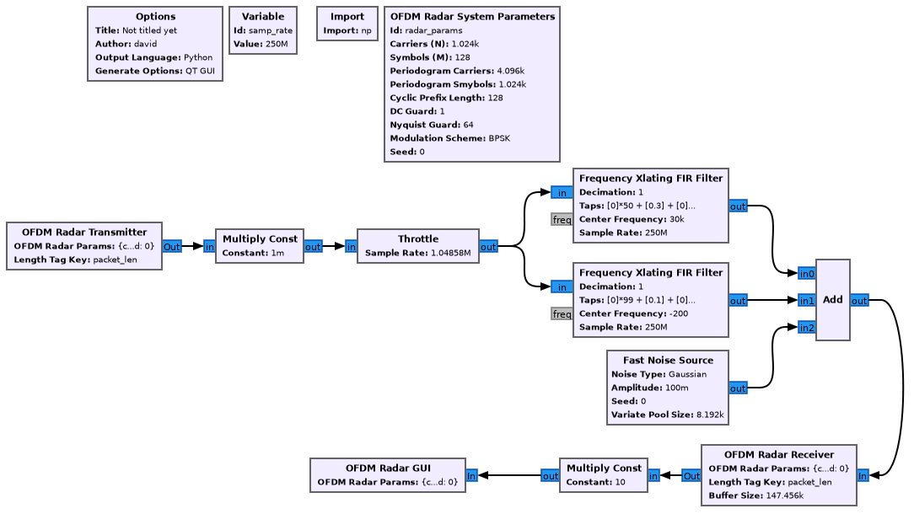
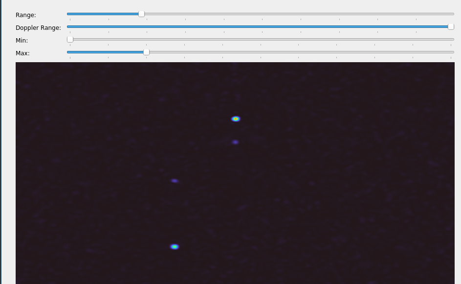

# gr-ofdmradar

This module implements a basic ofdm radar transmitter and receiver + visualization using a periodogram.
You can find an example flowgraph in `examples/ofdmradar_test.grc` implementing a static testbench.

## Example flowgraph



Output:



## Building

### Dependencies

* An installation of GNURadio 3.10 or later
* FFTW3
* OpenGL development headers and runtime

### Compilation & Installation

To build this module, first generate the build directory using cmake and then start the build using
make:

```
cmake -DCMAKE_INSTALL_PREFIX=/usr/local \
    -DPYTHON_EXECUTABLE=$(which python3) \
    -DPYTHON_INCLUDE_DIR=/usr/include/python3.9 \
    -DPYTHON_LIBRARY=/usr/lib/libpython3.9.so \
    -DGR_PYTHON_DIR=/usr/lib/python3.9/site-packages \
    -DCMAKE_BUILD_TYPE=Release \
    -B build \
    -S .

make -C build -j12
sudo make -C build install
```

## Operating principle

An OFDM radar works by transmitting a long, (partially) known, signal and then performing
deconvolution on the receiver to determine the impulse response of the channel. The techniques
which are employed are very similar to those in an ordinary OFDM communications system (thus the
name), and parts of the waveform (or rather carriers) can even be used for communication, although
that part is not implemented here.

We first introduce a set of parameters:

### System parameters

OFDM receiver and transmitter require a shared set of parameters which are constrained by the
environment and hardware. These determine the expected performance of the system.

First, knowledge of the following external parameters is required:

* System bandwidth (`B`)
* System sample rate (`f_s`)
* Carrier frequency (`f_c`)
* Sample memory (If your sample rate is low enough this might not be relevant, because data can be
  streamed continuously)

##### Carriers (`N`)

The OFDM FFT size, which is used to generate the time domain signal, determines `delta_f`.

`delta_f = f_s / N`, where `delta_f` must be smaller than the coherence bandwidth`B_C ~= 1/(2 * D_S)`,
where `D_S` is the delay spread, i.e.. the time difference between the first and last respose of
your channel.

##### Cyclic prefix

The cyclic prefix length needs to be `> D_S * f_s`.

##### Symbols (`M`)

How many OFDM symbols make up an OFDM frame. This determines the available doppler resolution ` =
f_s / (N + CP) / M`

##### Periodogram Carriers / Symbols

These parameters determine must be >= their normal counterpart, and determine the visual resolution
/ degree of interpolation in the radar output visualization.

##### DC Guard

Determines how many carriers around the DC carrier should be left empty, where a value of 1 means
that only the DC carrier itself will be unused, 2 leaves the DC carrier + one carrier on each side,
etc.. Certain hardware architectures cannot deal well with a DC component in the signal, as such you
should be careful when playing with this setting. On the other hand values != 0 can incur
significant spurs, for more information, including how to work around these, see [0].

##### Nyquist Guard

Determines how many carriers at the edges towards the higher frequencies should be left open.
Generally it is advisable to not use the full bandwidth of your ADC, and leave ~1/5 of your carriers
unused to ease filtering requirements.

##### Window type

The window type determines which window function will be applied to the received signal in post
processing. Fore a comparison of effects of window functions see [0].

##### Modulation Scheme

This parameter is rather was included for experimentation purposes, but is rather insignificant to
the performance of the system. (Citation needed)

### OFDM Radar Algorithm

#### Transmit symbol generation

To generate the TX data, the following steps are taken:

1. Initialize RNG seed
2. Fill an array of length N with random constellation symbols or zeros, depending on wether that
   carrier is excluded or not.
3. Perform an inverse FFT to transform the symbol into the time domain.
4. Prepend the cyclic prefix, i.e. take CP sample off of the end of the buffer and prepend them to
   the beginning.
5. Repeat M times from step 1.
6. Transmit continuous buffer.

#### Reception

Assuming the RX side received a buffer of samples that is in known relation with the TX timing,
we can proceed as follows. Note: This means that the time at which we start receiving samples and
the time at which the output start transmitting must be in a fixed, but not necessarily kown
relationship. The exact timing can be calibrated out later on, as long as it stays fixed.

1. We first skip CP samples, then take a buffer of N samples and transform that into the frequency
   domain using a N-point FFT.
2. Since we know the transmit signal and its frequency representation, we can just divide out the
   transmit symbols and receive an estimate of the channel influence in the frequency domain.
   Note that if the carrier was unused, it obviously can't be divided by, and is just set to zero.
   Because our system has a small doppler shift compared to `delta_t`, we can assume minimal
   inter-carrier interference.
3. Repeat from step 1 for all M symbols
4. If we align all of the received signals, in the frequency domain & compensated for the TX signal,
   in a receive matrix, the next step is to apply the window function and extend the matrix size to
   the periodogram dimensions as specified above.
5. Inverse FFT along the carrier dimension of our receive matrix to receive a time domain
   representation of the channel response, the channel impulse response.
6. FFT along the symbol axis; yields a doppler shift spectrum.

Now the processed receive matrix is just rendered to screen, with some post processing applied, like
converting our complex values to energy (|x|^2), color grading, etc.

Everything mentioned up until now can be found in much greater detail in [0].

## Implementation and integration

The implementation splits the OFDM Radar system into three main parts / blocks. The transmitter,
which generates a tagged sample stream, the receiver, which takes an input buffer and produces the
output receive matrix, and the GUI widget that is used to visualize that matrix.

If you want to integrate this with your own SDR source and sink blocks, there are some assumptions
to be aware of:

### Stream tags

First, the entire stream must be tagged using the packet tagging technique, where samples are
implicitly split into multiple blocks of samples and a stream tag at the beginning of each block
constains information about how long the current block is. For example a stream might look like
this:

```
-> [... x-2, x-1, x0, x1, x2, x3, x4, x5, x6, x7, x8, x9, x10, x11, x12, ... ]
                  ^                                       ^
                  | { packet_len: 10 }                    | { packet_len: 10 }

```

The SDR source must produce samples which are tagged using this information, where the beginning of
each packet must be aligned to that of the sink as explained in the next section.

### RX/TX Sample Synchronization

To determine a distance in a radar system, we measure the time between when a signal was sent, and
when the response or reflection was received. In common off-the-shelf systems, by default, there are
no guarantees about how our transmit sample stream relates to the received samples -
this will in fact depend on a variety of parameters, which you may or may not be able to control.
The USRP series of SDRs for example allows you to select exact transmit and receive times using
the timed command interface (See [1]).

For the hardware that this module was developed on, the following approach was used:

Note: Because only bursts of samples are interesting to us, and that at fairly high sample rates,
only bursty transmissions with empty sections in between are considered.

The original reference design without modifications looks something like this:

```
                             ---------------------
                             |                   |
            -------    -------------    -------  |
 Antenna -> | ADC | -> | JESD Link | -> | DMA | -------
            -------    -------------    -------  |    |
                             |                   |    |      -------
                             |                   |    -----> |     |
                             |    FPGA Fabric    |           | CPU |
                             |                   |    ------ |     |
                             |                   |    |      -------
            -------    -------------    -------  |    |
 Antenna <- | DAC | <- | JESD Link | <- | DMA | <------
            -------    -------------    -------  |
                             |                   |
                             ---------------------
```

On a high level, to allow for timing synchronization, the RX DMAs input valid signal
was overriden by a sync signal, and on the TX side the DMA output ready signal was overriden by the
same, or one with a fixed timing relationship to that of the RX DMA (To allow for the compensation
of processing or pipeline influences, JESD link latency compensation, etc.).


```
                             -------------------------------------
                             |                                   |
            -------    -------------                    -------  |
 Antenna -> | ADC | -> | JESD Link | -----------------> | DMA | -------
            -------    -------------                 ^  -------  |    |
                             |                       |           |    |      -------
                             |                 --------------    |    -----> |     |
                             |   FPGA Fabric   | TDD Engine |    |           | CPU |
                             |                 --------------    |    ------ |     |
                             |                       |           |    |      -------
            -------    -------------                 v  -------  |    |
 Antenna <- | DAC | <- | JESD Link | <----------------- | DMA | <------
            -------    -------------                    -------  |
                             |                                   |
                             -------------------------------------
```

The Timing Division Duplexing (TDD) engine was used to generate periodic pulses with configurable
length and at configurable times. All in all, the system basically represents a multi-channel
trigger, akin to multi-channel oscilloscopes, but with (optionally) configurable timing offset
between the channels.

## References

* \[0\] Martin Braun, OFDM Radar Algorithms in Mobile Communication Networks, 2014, DOI: 10.5445/IR/1000038892
* \[1\] [Synchronizing USRP Events Using Timed Commands in UHD](https://kb.ettus.com/Synchronizing_USRP_Events_Using_Timed_Commands_in_UHD)

